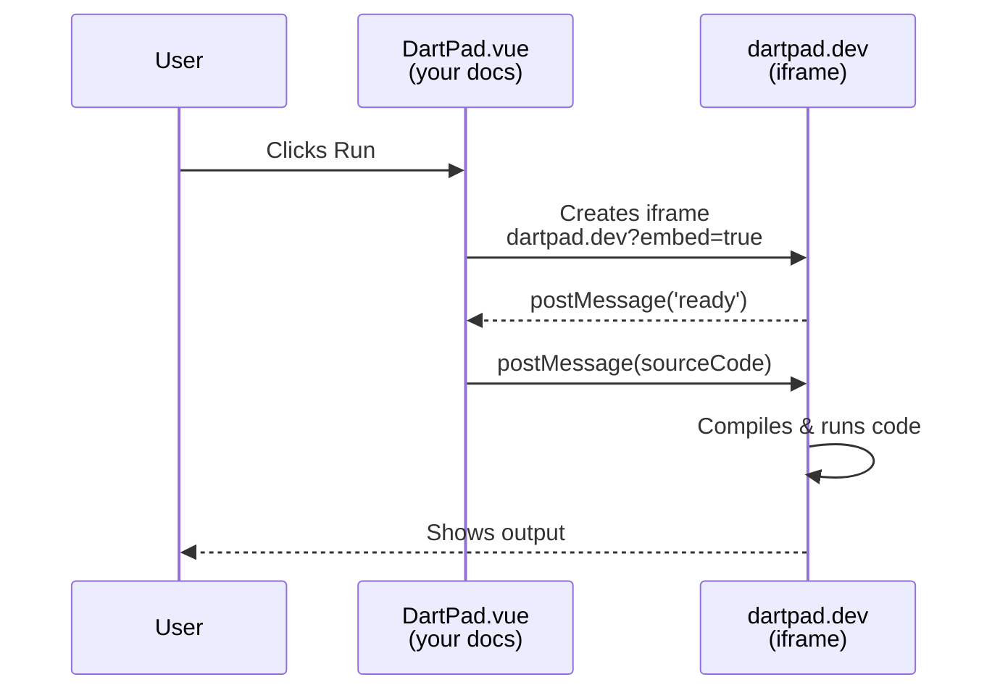

# DartPad Embeds

dartdoc-vitepress turns code blocks into interactive [DartPad](https://dartpad.dev) playgrounds. Your readers can run and edit Dart code without leaving the docs page.

## Syntax

Use a fenced code block with the `dartpad` language tag instead of `dart`:

````markdown
```dartpad
void main() {
  print('Hello from DartPad!');
}
```
````

This renders as a syntax-highlighted code block with **Play** and **Copy** buttons. Clicking Play opens an embedded DartPad iframe with the code loaded and ready to run.

## Live Example — Dart

```dartpad
void main() {
  final items = ['Dart', 'Flutter', 'VitePress'];

  for (final item in items) {
    print('dartdoc-vitepress supports $item');
  }

  // Try editing this code and clicking Run!
  print('\nGenerated ${items.length} items');
}
```

Click the **▶ Play** button above to open the interactive playground.

## Attributes

Add attributes after `dartpad` to customize behavior:

````markdown
```dartpad height=500 mode=flutter run=false
// your code
```
````

| Attribute | Values | Default | What it does |
|-----------|--------|---------|-------------|
| `height` | any number | `400` | Iframe height in pixels |
| `mode` | `dart`, `flutter` | `dart` | DartPad mode — pure Dart or Flutter widget |
| `run` | `true`, `false` | `true` | Auto-run code when the playground opens |

## Flutter Example

Use `mode=flutter` for Flutter widgets:

```dartpad mode=flutter height=500
import 'package:flutter/material.dart';

void main() => runApp(const MyApp());

class MyApp extends StatelessWidget {
  const MyApp({super.key});

  @override
  Widget build(BuildContext context) {
    return MaterialApp(
      debugShowCheckedModeBanner: false,
      home: Scaffold(
        appBar: AppBar(title: const Text('DartPad in Docs')),
        body: Center(
          child: Column(
            mainAxisAlignment: MainAxisAlignment.center,
            children: [
              const Icon(Icons.auto_stories, size: 64, color: Colors.deepPurple),
              const SizedBox(height: 16),
              Text(
                'Interactive docs!',
                style: Theme.of(context).textTheme.headlineMedium,
              ),
              const SizedBox(height: 8),
              const Text('Edit this code and hit Run'),
            ],
          ),
        ),
        floatingActionButton: FloatingActionButton(
          onPressed: () {},
          child: const Icon(Icons.play_arrow),
        ),
      ),
    );
  }
}
```

## Without Auto-Run

Use `run=false` when the code is long or you want the reader to review it before running:

```dartpad run=false
import 'dart:math';

void main() {
  final random = Random();
  final numbers = List.generate(10, (_) => random.nextInt(100));

  print('Original: $numbers');
  numbers.sort();
  print('Sorted:   $numbers');
  print('Sum:      ${numbers.reduce((a, b) => a + b)}');
  print('Average:  ${numbers.reduce((a, b) => a + b) / numbers.length}');
}
```

## How It Works

1. The markdown-it plugin (`dartpad.ts`) detects ` ```dartpad ` fences
2. It base64-encodes the code and emits a `<DartPad>` Vue component
3. The component shows syntax-highlighted code with a toolbar
4. On **Play**, it creates an iframe to `https://dartpad.dev?embed=true`
5. Once DartPad sends a `ready` message, the component sends the code via `postMessage`
6. Theme (light/dark) syncs automatically with VitePress



## Security

- Communication uses `postMessage` with origin checks — only `dartpad.dev` and `dartpad.cn` are allowed
- The iframe runs sandboxed: `allow-scripts allow-same-origin allow-popups allow-forms`
- No external scripts are loaded until the user clicks Play

## Tips

- Keep examples short and focused — readers should see the output without scrolling
- Use `mode=flutter` only when demonstrating widgets; plain Dart runs faster
- Add comments like `// Try changing this value!` to encourage experimentation
- `run=false` is useful for code that has side effects or takes time to execute
- DartPad supports most `dart:*` libraries and popular pub packages (http, collection, etc.)
